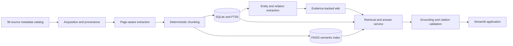

# Technical Implementation Report

## Document control

| Field | Value |
|---|---|
| System | Conservation Document Intelligence |
| Version | 1.1 variant |
| Date | August 26, 2026 |
| Primary entrypoint | `app.py` |
| Requirements baseline | `Document_Intelligence_Project_Description.docx` and `Hugging_Face_Spaces_Deployment_Guide_Conservation_Prototype.docx` |

## 1. Executive summary

Conservation Document Intelligence is a reproducible research prototype for exploring 36 public conservation sources. This independent variant adds the PI-supplied 2022 Missouri Comprehensive Conservation Strategy, two-level Wiki navigation, hidden Wiki build metadata, entity-focused cited Wiki summaries, and an answer-first chatbot while retaining key supporting findings and cited supporting documents.

The deployed application reads versioned runtime artifacts. It does not download documents, extract text, or rebuild indexes during normal startup. Corpus browsing, keyword search, wiki browsing, and saved evaluation reports work without an API key. Semantic queries and live chatbot answers require `OPENAI_API_KEY`.

The inherited prototype satisfied the functional outcomes in the project description and received a provisional document-rubric self-score of 95/100. Those official, regression, audit, and holdout results predate DOC036 and remain baseline evidence. The variant live development review and separately frozen DOC036-centered holdout are now complete. That holdout failed its strict gate at 12 PASS, 5 PARTIAL, and 3 FAIL, so the variant is suitable for a transparently labeled research demonstration but does not yet satisfy the acceptance process in `VARIANT_REQUIREMENTS.md`.

## 2. Requirements interpretation and approved hosting change

The two supplied DOCX files were treated as the requirements source of truth. Required outcomes were converted into implementation phases and acceptance gates covering:

- a traceable inherited 35-source conservation corpus, extended to 36 sources by the approved PI requirement;
- page-aware extraction and search;
- typed entities and five required relationship types;
- at least 10 evidence-backed wiki pages;
- a five-tab Streamlit application;
- a corpus-grounded chatbot with source and page citations;
- evaluation using the 10 official questions and the supplied rubric; and
- deployable packaging with protected credentials.

The original deployment guide targeted a Docker-based Hugging Face Space. The project owner later selected Streamlit Community Cloud because paid Docker hosting was not desired. This is an approved hosting-adapter change. It does not alter the data pipeline, retrieval logic, knowledge layer, chatbot controls, evaluation artifacts, or user-facing capabilities. The Dockerfile remains available as an optional packaging route.

## 3. System architecture

The system has two execution modes:

1. **Offline build mode:** numbered scripts acquire and process sources, build indexes, extract knowledge, generate wiki pages, and produce evaluation artifacts.
2. **Runtime mode:** the Streamlit app opens the precomputed SQLite database, FAISS index, wiki, and reports. Only query embeddings and chatbot generation call the OpenAI API.

This separation makes startup deterministic, reduces cloud cost, and prevents deployment failures caused by unavailable external source websites.

## 4. Implementation details

### 4.1 Repository organization

| Path | Responsibility |
|---|---|
| `app.py` | Streamlit user interface and runtime composition |
| `config.yaml` | Chunking, retrieval, model, and chatbot defaults |
| `data/metadata.csv` | Canonical 36-source catalog and provenance |
| `db/conservation.db` | Runtime SQLite corpus, FTS index, entities, relations, and wiki registry |
| `vector_index/` | Persisted FAISS index and corpus manifest |
| `wiki/` | Generated, reviewable Markdown wiki pages |
| `src/conservation_intelligence/` | Testable acquisition, extraction, retrieval, knowledge, wiki, and chatbot services |
| `scripts/` | Reproducible pipeline, evaluation, and validation commands |
| `outputs/` | Evaluation results, exports, audits, and status reports |
| `tests/` | Unit, integration, artifact, regression, and Streamlit smoke tests |

All runtime paths are resolved relative to the project root. Machine-specific absolute paths are not embedded in the application.

### 4.2 Corpus catalog and acquisition

The catalog contains exactly `DOC001` through `DOC036`. DOC036 is the PI-supplied 2022 Missouri Comprehensive Conservation Strategy; its supplied-file checksum and official public URL are separately retained. Every record preserves its URL and provenance and records agency, topic, file type, acquisition status, retrieval time, checksum, extraction status, page count, and explanatory notes.

Acquisition uses resumable HTTP requests with retries, timeouts, content-type checks, deterministic filenames, and SHA-256 checksums. Broken or indirect sources are not silently removed. Replacements are documented in `data/source_replacements.csv` while preserving the intended agency and topic.

Raw downloads and extracted page files are build-time artifacts and are excluded from the deployment repository. Their derived runtime content is stored in the versioned SQLite database.

### 4.3 Text extraction and chunking

PDF extraction uses `pypdf` page by page. HTML sources are cleaned with Beautiful Soup. Normalized text retains stable page markers so every chunk can be traced to a document and page or page range.

Chunking is deterministic and does not cross document boundaries. Current configuration is:

| Setting | Value |
|---|---:|
| Target words | 750 |
| Minimum words | 600 |
| Maximum words | 900 |
| Overlap | 100 words |
| Stored chunks | 982 |

Every chunk has a stable ID, document ID, page value, text, title, source URL, word count, and content hash.

### 4.4 SQLite and keyword retrieval

SQLite is the canonical runtime store. Its schema contains:

- `documents` for source metadata;
- `chunks` for page-aware evidence;
- `entities` for typed mentions;
- `relations` for evidence-linked relationships;
- `wiki_pages` for generated page registration;
- `pipeline_runs` for processing status; and
- `chunks_fts`, an FTS5 virtual table for keyword retrieval.

FTS5 uses Porter stemming with Unicode tokenization. Search queries are normalized before execution, and results return the chunk ID, document ID, page, title, source URL, text, and rank. Retrieval utilities also remove low-information fragments, diversify documents, load exact wiki evidence, and recover neighboring chunks when evidence crosses a chunk boundary.

### 4.5 Semantic retrieval

The semantic index uses OpenAI `text-embedding-3-small` embeddings and a persisted FAISS `IndexFlatIP` index. Vectors are L2-normalized, making inner-product search equivalent to cosine similarity. Current index characteristics are:

| Property | Value |
|---|---:|
| Vectors | 982 |
| Dimensions | 1,536 |
| Index file | Approximately 5.8 MB |
| Corpus database | Approximately 17 MB |

The manifest stores the embedding model, ordered chunk IDs, vector dimensions, build time, chunk count, and a digest derived from every chunk ID and content hash. Semantic search is automatically disabled if the manifest does not match the current corpus or if the configured embedding model differs.

### 4.6 Entity and relationship extraction

The knowledge layer is deterministic and audit-oriented. A curated YAML lexicon provides canonical names and aliases. Regular expressions and explicit linguistic patterns extract mentions and relationships only when suitable evidence is present.

Supported entity types are:

- species;
- habitat;
- river;
- wetland;
- agency;
- location;
- threat;
- program;
- policy; and
- date.

Required relationship types are:

- `species_uses_habitat`;
- `threat_affects_species`;
- `agency_manages_program`;
- `document_mentions_location`; and
- `document_mentions_species`.

Stable entity and relation IDs are derived from SHA-256 inputs. Every record includes its document, chunk, evidence text, and confidence. Evidence-quality filters reject bibliography-like, navigation-like, or otherwise unsuitable fragments before relationship creation.

The current knowledge layer contains 9,612 entity mentions and 1,389 evidence-linked relations. The inherited relation audit covers 987/987 baseline integrity checks and 37/37 manually reviewed baseline rows; the 402 DOC036 relations pass automated integrity checks but still require separate variant manual review.

### 4.7 Evidence-backed wiki

The wiki generator ranks entities using evidence quality, mention frequency, and source diversity. It creates reviewable Markdown rather than generating pages dynamically at runtime.

The current wiki contains 15 pages distributed across:

- species;
- habitats;
- locations;
- threats; and
- agencies.

Pages lead with an extractive Summary containing the strongest one or two retained evidence statements and their citations. Mention and document counts appear separately under Corpus coverage. Key facts contains only subsequent retained statements and is omitted when no additional evidence remains. Pages also include supporting evidence, related documents, related entities, and open questions where applicable. Citation and link validators reject Summary/Key facts duplication and check each generated page. The regenerated variant Wiki has 27/27 cited summary statements and 36/36 additional key facts traceable to stored evidence, with 83/83 internal links resolving; its historical manual audit predates DOC036.

### 4.8 Chatbot retrieval and answer control

The production chatbot follows a guarded retrieval-augmented generation pipeline:

1. Normalize and validate the question.
2. Reject empty questions, questions over 1,000 characters, corpus-bypass requests, and restricted privacy-scope requests.
3. Route supported inventory, frequency, gap, summary, and corroboration questions to deterministic handlers where appropriate.
4. Retrieve keyword candidates from SQLite FTS5.
5. Decompose comparisons and alternative branches into supplemental retrieval queries.
6. When a current index and API key are available, retrieve semantic candidates.
7. Fuse independent rankings using reciprocal-rank fusion.
8. Add relevant neighboring chunks and remove low-information evidence.
9. Rank by question-scope coverage and choose facet-balanced evidence, normally six chunks with no more than two per document.
10. Reject the question before generation when retrieved evidence does not cover required scope.
11. Make one structured OpenAI Responses API call requesting a sufficiency decision, a concise direct answer, and up to five atomic supporting claims.
12. Require every claim to provide one authorized source label and an exact supporting span.
13. Repair label collisions and narrow invalid ellipses without making another model call.
14. Remove invalid claims; require surviving claims to cover mandatory question facets.
15. Accept the model-authored direct answer only when every factual sentence is source-labelled, its labels refer to surviving claims, its terms and numbers occur in those claims, and it covers the mandatory question facets.
16. If the direct answer fails those checks, compose a safe direct answer locally from the validated claim units; do not make another model call.
17. Resolve internal labels to citations such as `[DOC012, p. 5]`.
18. Run final citation, claim-support, numeric-copying, scope, and formatting checks.
19. Return an extractive fallback or the explicit insufficient-evidence response if validation cannot establish support; otherwise present **Answer**, **Key supporting findings**, cited supporting documents, and all retrieved evidence.

The normal supported path uses one query-embedding call and at most one chat-model call. Defaults are `gpt-4.1-mini`, six evidence items, 20 retrieval candidates, and 1,000 output tokens. The UI additionally limits each browser session to 20 chatbot questions.

This architecture intentionally prefers a supported abstention over an unsupported answer. The final holdout shows that this safety choice still produces false abstentions on some answerable paraphrases.

### 4.9 Streamlit application

The interface provides five required tabs:

| Tab | Function |
|---|---|
| Corpus | Browse and filter the 36-source catalog and open original sources |
| Search | Run keyword or semantic retrieval and inspect page-aware snippets |
| Wiki | Choose an entity type, then an entity; read a cited entity summary separately from corpus coverage without exposed YAML front matter |
| Chatbot | Read a direct answer first, then key supporting findings, cited supporting documents, and expandable all retrieved evidence |
| Evaluation | Inspect corpus metrics, suggested questions, saved reports, and feedback link |

The app starts in reduced mode without `OPENAI_API_KEY`. Corpus browsing, keyword retrieval, the wiki, and saved evaluation remain available; semantic queries and live chatbot input are disabled or report missing configuration clearly.

### 4.10 Configuration and secrets

Non-secret defaults are stored in `config.yaml`. Local development reads `.env` through `python-dotenv` without overriding already-exported environment variables.

The following runtime settings are supported:

| Setting | Required | Purpose |
|---|---|---|
| `OPENAI_API_KEY` | For semantic queries and chatbot | OpenAI authentication |
| `OPENAI_CHAT_MODEL` | No | Override `gpt-4.1-mini` |
| `OPENAI_EMBEDDING_MODEL` | No | Override `text-embedding-3-small` |
| `FEEDBACK_FORM_URL` | No | External evaluation survey |
| `VECTOR_STORE_ID` | No | Reserved for an optional hosted retrieval adapter |

`.env` and `.streamlit/secrets.toml` are excluded from Git. Streamlit Cloud secrets must be entered as root-level TOML so the existing code can read them as environment variables.

## 5. Quality assurance and evaluation

### 5.1 Automated verification

The current variant suite contains 145 passing tests. Coverage includes:

- catalog completeness and metadata validation;
- acquisition, extraction, and chunking behavior;
- database and FTS integrity;
- semantic-index currency and dimension checks;
- entity and relationship evidence;
- wiki structure, facts, citations, and links;
- chatbot scope, retrieval, claim, citation, abstention, and adversarial behavior;
- evaluation artifact integrity;
- Streamlit rendering of all five tabs; and
- Streamlit Cloud deployment artifacts and secret exclusions.

The local server smoke test returned `ok` from `/_stcore/health` and HTTP 200 from the main page.

### 5.2 Evaluation results

The first five rows below are inherited prototype results. The final row is the
separately frozen, exactly-once DOC036-centered variant evaluation required by
`VARIANT_REQUIREMENTS.md`.

| Evaluation set | Result | Interpretation |
|---|---:|---|
| Official document questions | 10 PASS / 0 PARTIAL / 0 FAIL | Required demonstration; questions informed development |
| H known regression | 20/20 expected behavior | Post-repair regression evidence |
| F known regression | 20/20 expected behavior | Post-repair regression evidence |
| G known regression | 20/20 expected behavior | Post-repair regression evidence |
| Final untouched J holdout | 11 PASS / 4 PARTIAL / 5 FAIL | Independent generalization evidence; internal gate failed |
| DOC036 variant holdout V1 | 12 PASS / 5 PARTIAL / 3 FAIL | 8/16 supported questions fully passed; 4/4 required abstentions passed; strict gate failed |

The final J set found five answerable questions that were rejected after usable evidence had been retrieved, plus four answers containing cited but semantically adjacent material. This confirms that post-generation scope and coverage validation, rather than basic source retrieval, is the main remaining quality limitation.

The DOC036-centered set confirms that the new document is indexed and can
support many questions, while exposing three additional failure modes: selecting
the wrong section of a long internally repetitive document, competition from
overlapping inherited sources, and loss of requested facets during coverage or
claim-pruning validation. The full immutable first-run review is in
`outputs/variant_holdout_v1_first_run_audit.md`.

### 5.3 Document rubric

| Category | Score |
|---|---:|
| Corpus and metadata | 20/20 |
| Search and retrieval | 19/20 |
| Entity and relation extraction | 18/20 |
| LLM wiki | 18/20 |
| Chatbot and demonstration | 20/20 |
| **Total** | **95/100** |

This is a provisional internal self-score, not independent conservation-domain certification.

## 6. Security, privacy, and cost controls

- Credentials are read only from runtime secrets or local environment configuration.
- The OpenAI key is never rendered in the interface.
- Retrieved source text is treated as untrusted data in the answer prompt.
- Source labels are allow-listed and resolved only to retrieved corpus records.
- Questions are sent to OpenAI for live query embeddings; questions and selected public-corpus evidence are sent for answer generation. Users should not enter confidential or personal information.
- A 1,000-character question limit, 1,000-token answer limit, single structured model call, zero automatic OpenAI retries, and 20-question session cap constrain cost.
- A public Streamlit app can create charges against the owner's OpenAI project. Provider-side project budgets and monitoring remain necessary.

## 7. Deployment and operations

The selected deployment is Streamlit Community Cloud connected to the independent GitHub repository `CharlesChen130/conservation-document-intelligence-variant`. Repository visibility and application visibility are owner-controlled settings; the app URL, secrets, and rollback remain separate from other CDIP deployments.

Deployment parameters are:

- branch: `main`;
- entrypoint: `app.py`;
- Python: 3.12;
- dependencies: `requirements.txt`; and
- secret: root-level `OPENAI_API_KEY` in Streamlit's Secrets console.

The runtime database, FAISS index, wiki, and evaluation reports are committed. Raw documents and extracted build files are not required at startup. Updates are deployed by pushing a reviewed commit to GitHub. Rollback uses a prior known-good Git commit.

Community Cloud can hibernate after inactivity. A restart loses browser session history but retains the versioned corpus and index.

## 8. Known limitations

- Neither the inherited final holdout nor the DOC036-centered variant holdout passed its strict internal gate.
- The finite rule-based entity lexicon prioritizes precision over recall.
- Four wiki pages contain one publishable fact rather than lower-quality filler.
- Search snippets may start before the exact supporting sentence in a long chunk.
- Model and embedding behavior can change when provider models change.
- The application has no cross-user conversation persistence.
- Streamlit session limits are not a global rate limiter; a public deployment still requires provider-side spending controls.
- No independent conservation-domain expert has certified the entity layer, wiki, or answers.
- The prototype must not be used as the sole basis for consequential conservation, legal, financial, or policy decisions.

## 9. Requirements traceability

| Required outcome | Implementation evidence |
|---|---|
| Organized public conservation corpus | `data/metadata.csv` and 36 document records, including DOC036 provenance |
| Searchable documents | SQLite FTS5 and FAISS over 982 page-aware chunks |
| Structured entities and relations | 9,612 mentions, 1,389 evidence-linked relations, five required relation types |
| Evidence-backed wiki | Two-level navigation over 15 Markdown pages with 27 cited summary statements, 36 additional nonduplicated key facts, separate corpus coverage, and 83 valid links |
| Cited chatbot | Validated model-authored answer from the same structured call, safe claim-derived fallback, key supporting findings, cited supporting-document list, detailed evidence, and deterministic validation |
| Evaluation questions and rubric | `outputs/demo_answers.md`, correctness audits, holdouts, and `outputs/requirements_evaluation.md` |
| Deployable interface | Five-tab `app.py`, pinned dependencies, persisted artifacts, Streamlit deployment guide |
| Secret protection | `.gitignore`, `.env.example`, and Streamlit Secrets workflow |

## 10. Conclusion

The system implements the required conservation-document intelligence workflow end to end and is reproducible from versioned runtime artifacts. Its strongest properties are provenance, inspectable evidence, deterministic knowledge artifacts, citation enforcement, and explicit abstention. Its principal unresolved weakness is generalization of the scope and coverage validator to unseen paraphrases. Deployment is therefore appropriate for research demonstration and user evaluation with clear limitations, not for authoritative decision support.
